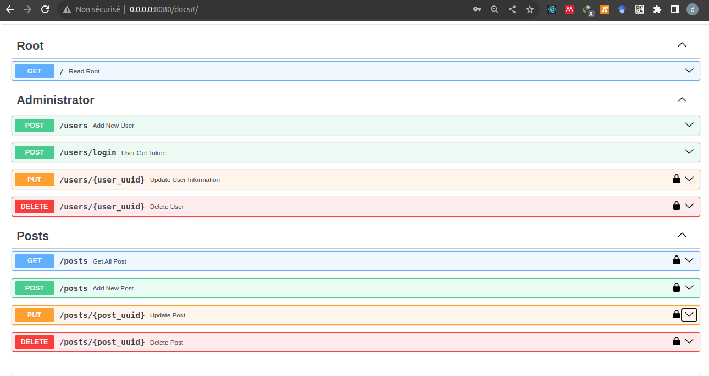
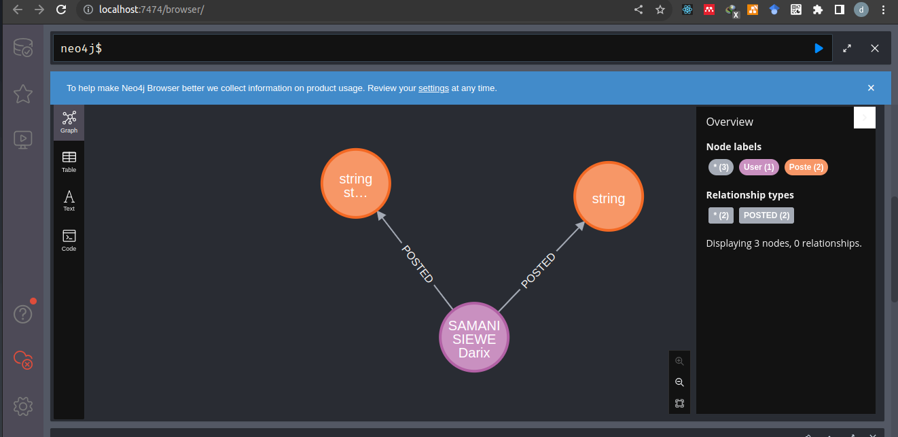

# 🚀 FastAPI & Neo4j Boilerplate
[](https://fastapi.tiangolo.com/)
[](https://neo4j.com/)
[](https://www.docker.com/)
[](LICENSE)
[]()


A lightweight starter template for building **RESTful APIs** with **FastAPI** and **Neo4j**. Perfect for quick prototyping or starting a new project! 🐍🗄️

---

## ✨ Features

- 🐍 **Python FastAPI backend**
- 🗄️ **Neo4j graph database**
- 🔐 **Authentication system**
- 🚀 **Deployment-ready**

---

## ⚡ Getting Started

Follow these steps to get the application running locally or with Docker.

### 1️⃣ Clone the Repository & Create a Virtual Environment

     ```
     uv venv
     ```

### 2️⃣ Run Neo4j with Docker

Start a Neo4j instance using Docker:

```bash
docker run \
  --name fastapi_ne4j \
  --publish=7474:7474 --publish=7687:7687 \
  --volume=$HOME/neo4j/data:/data \
  --env NEO4J_AUTH=neo4j/darixsamani \
  neo4j
```


### 3️⃣ Configure Environment Variables

You need to set up your local environment for the application to connect to Neo4j.

1. Create a `.env.dev` file based on the sample provided:

```bash
cp .env.sample .env.dev
```


### 4️⃣ Start the FastAPI Application

Once your environment is set up, start the FastAPI server:

```bash
uv run main.py
```

### 5️⃣ Run the Project with Docker Compose

You can run the entire project using Docker Compose for an easy setup.

**Start the services:**

```bash
docker compose up -d
```

**Stop the services:**
```bash
docker compose down
docker compose rm -vf
```


The starter listens on port 8000 on address [0.0.0.0](0.0.0.0:8080). 




The Neo4j Database example




